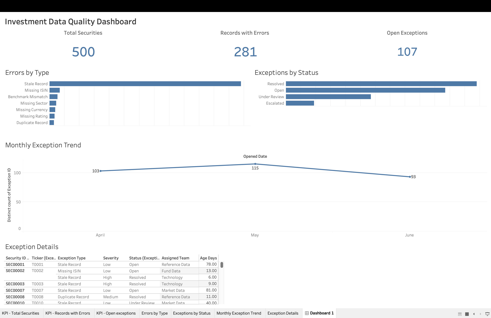

# Investment Data Quality Dashboard

An interactive Tableau dashboard for monitoring investment data quality and exception management.

## Features

- Monitor data quality KPIs
- Analyse errors by type
- Track exception status and monthly trends
- Investigate exception details with interactive filtering

## Tech Stack

- Tableau Public
- Excel
- Git
- GitHub

## Dashboard

